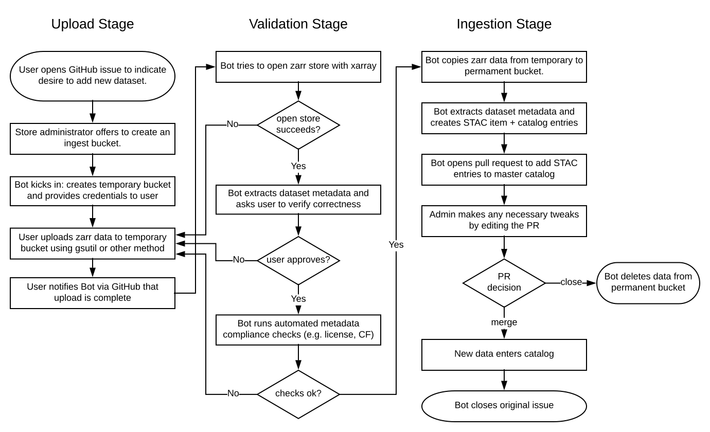

# Pangeo Cloud Datastore

The Pangeo project has demonstrated the value of placing datasets in cloud
storage, where they are broadly available and directly accessible to scalable
cloud computing.
Xarray, dask, and zarr work very well together in this context.

The next step is to facilitate the creation of cloud-based data repositories.
Such a repository would have the following elements:
- A consistent, searchable master database of all the datasets under its control
- Some sort of ingest mechanism, such as a staging bucket that people can upload
  to, separate from the production bucket
- Basic validation of uploaded datasets
- A web interface to browse the data available
- A mechanism to assign DOIs

### Useful Repo Links

These projects might be useful in developing the datastore.

- **[Zarr](https://github.com/zarr-developers/zarr)**: The storage format
- **[STAC Spec](https://github.com/radiantearth/stac-spec)**: core STAC specification
- **[Sat STAC](https://github.com/sat-utils/sat-stac)**: Python library for working with STAC
- **[Intake](https://github.com/ContinuumIO/intake)**: Python library for loading data
  (see also [intake-xarray](https://github.com/ContinuumIO/intake-xarray))
- **[Pydap](https://github.com/pydap/pydap)**: Python-based opendap server
- **[Opsdroid](https://github.com/opsdroid/opsdroid)**: Chat bot framework written
  in python aimed at DevOps community.

### Brainstorming User Experience

I made this flow chart to explain how a datastore service might work.

(Source: [lucidchart](https://www.lucidchart.com/invitations/accept/03c7e060-8db0-4600-a4d9-7160030fb254))

### STAC Examples

There are valid example stac files in the `example-stac-entries` folder.

To upload example files to google cloud

    gsutil cp example-stac-entries/*.json gs://pangeo-stac/test/
